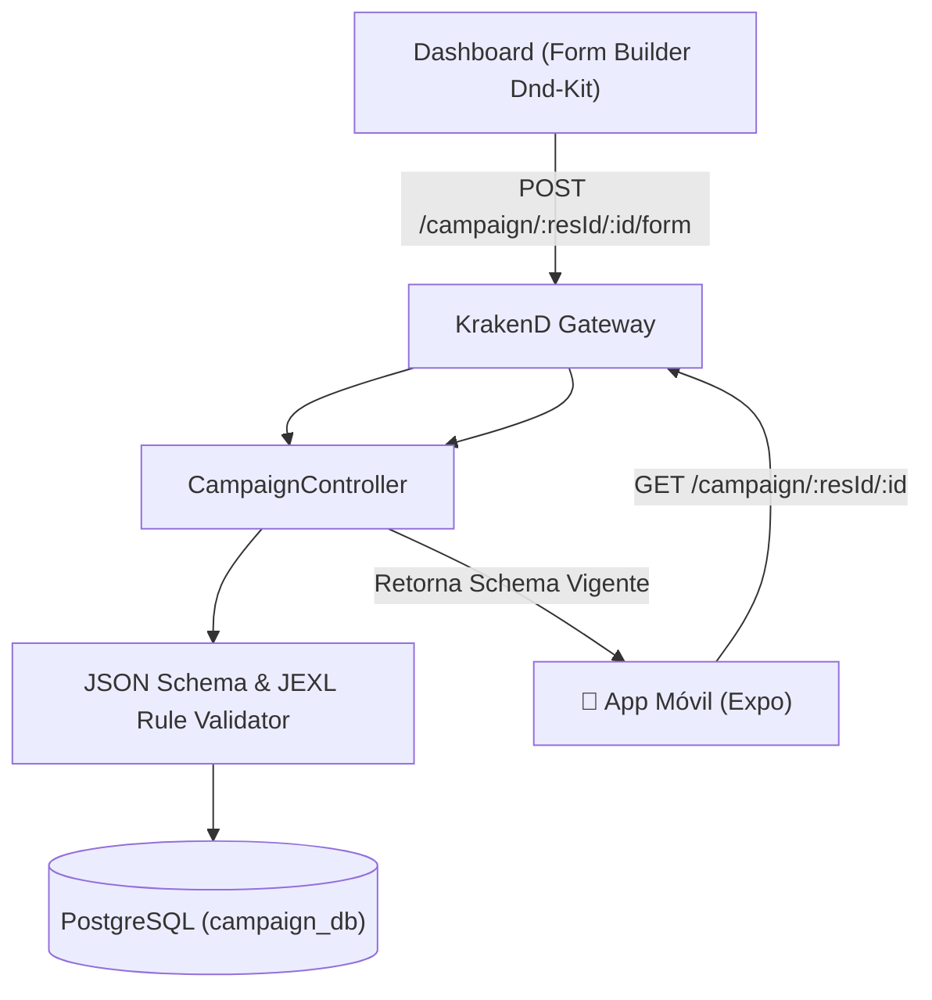

# Arquitectura Técnica — service-campaign

## 1. Visión General del Servicio
`service-campaign` orquesta la definición operativa de campañas y el motor de esquemas JSON para el levantamiento de información en campo.

---

## 2. Inmutabilidad de Versiones Publicadas

1. Cuando un formulario se edita en el Dashboard, se almacena con estado `DRAFT`.
2. Al pulsar **Publicar Versión**:
   - Se valida la coherencia de todos los identificadores únicos (`id`).
   - Se congela la versión actual asignando el estado `PUBLISHED` y la marca de tiempo `publishedAt`.
   - Se actualiza `currentFormVersion` en la tabla `campaign`.
3. Cualquier medición capturada en campo asociará este `formVersion`, garantizando compatibilidad histórica aunque el formulario sea modificado en el futuro.
