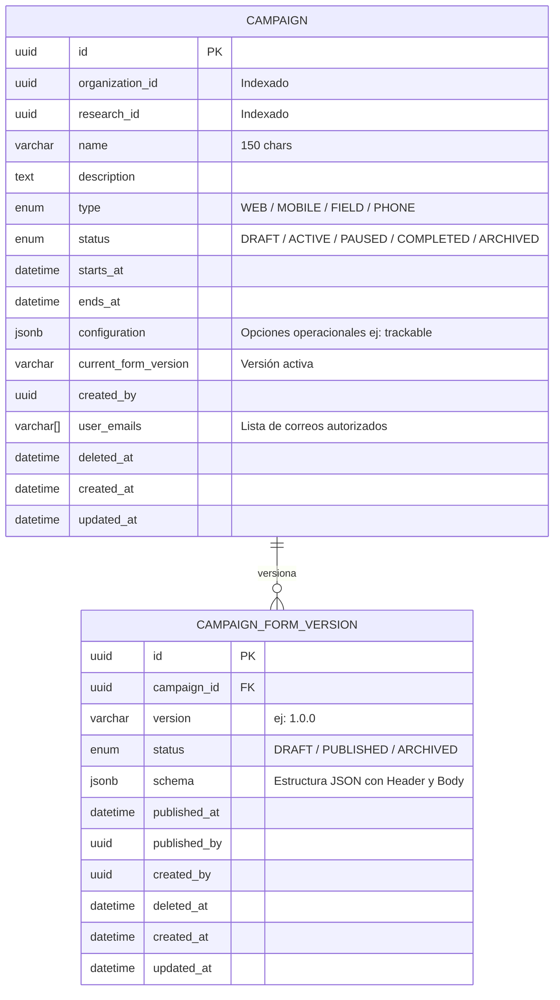

# Base de Datos y Modelo Físico — service-campaign

## 1. Diagrama Entidad-Relación (ERD)



---

## 2. Estructura del JSON Schema del Formulario

```json
{
  "form": {
    "header": [
      {
        "id": "codigo_estacion",
        "type": "text",
        "label": "Código de Estación",
        "dynamic": { "required": true }
      }
    ],
    "body": [
      {
        "id": "tipo_vehiculo",
        "type": "select",
        "label": "Tipo de Vehículo",
        "options": [
          { "value": "auto", "label": "Automóvil" },
          { "value": "bus", "label": "Autobús" }
        ]
      },
      {
        "id": "foto_aforo",
        "type": "camera",
        "label": "Fotografía"
      }
    ]
  }
}
```
